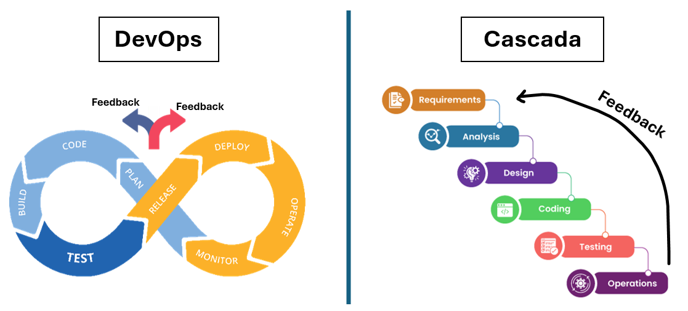
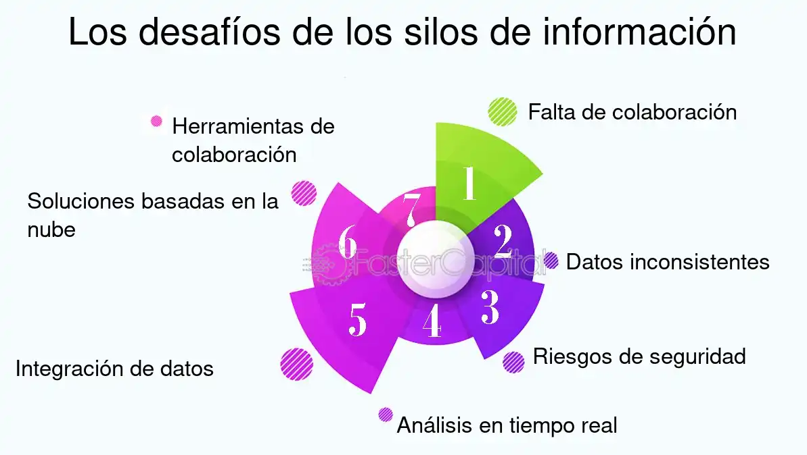

# Actividad 1: introducción devops, devsecops

**Nombre:** Luis Alanya Campos - 20210290J

**Fecha y tiempo invertido:** 

**Contexto del entorno:** 

## Desarrollo de la Actividad 1

### 1. DevOps vs cascada tradicional (investigación + comparación)

**1.1.** DevOps vs Cascada

La imagen ayuda a diferenciar (de manera visual y fácil) las dos metodologías: DevOps y Cascada.

En el caso de la metodología de la cascada, vemos como la retroalimentación se hace en el proceso final del proyecto, retrasando las mejoras que se pudo haber hecho en previas etapas.

En el caso de la metodología DevOps, la retroalimentación se realiza en cualquier fase, y se hacen hacía cualquier fase. Así, cualquier crítica que se quiera hacer será siempre escuchada, haciendo más eficiente la comunicación y fortaleciendo el trabajo en equipo.

**1.2.** Explica por qué DevOps acelera y reduce riesgo en software para la nube frente a cascada (feedback continuo, pequeños lotes, automatización)

La metodología DevOps permite acelerar y reducir los riesgos en el tema de desarrollo de software para la nube, esto debido a que se recibe feedback/retroalimentación de forma seguida, detectando los errores tempranamente y corrigiéndolos. También, se trabaja en lotes pequeños de cambios, haciendo más fácil la detección y solución de problemas sin ponen en riesgo todo el sistema.

En el tema de la automatización, según Redondo y Cárdenas (2022), la automatización de pruebas y despliegue (CI/CD) disminuye de igual manera los errores humanos y también hace que todos los procesos sean más rápidos, a comparación del método en cascada, método tradicional donde los cambios se revisan y entregan solamente en la parte final. 

**1.3.** **Pregunta retadora:** señala un **contexto real** donde un enfoque cercano a cascada sigue siendo razonable (por ejemplo, sistemas con certificaciones regulatorias estrictas o fuerte acoplamiento hardware). Expón **dos criterios verificables** y **los trade-offs** (velocidad vs. conformidad/seguridad).

Un contexto real podría ser el desarrollo de software para el área de la medicina (equipos médicos), por ejemplo una máquina de escaneo de rayos X. Para estos casos se necesitan de certificaciones de entes reguladoras, además de una documentación detallada.

Criterios verificables:
- El cumplimiento de normativas y certificaciones, en este caso, la certificación ISO para dispositivos médicos.
- Realización de documentación completa, además de mantener una trazabilidad de los cambios que se hagan.

Trade-offs:
- Velocidad: El proceso en estos casos son más lentos debido a que cada fase debe completarse y luego pasar por un proceso de validación antes de pasar a la siguiente fase.
- Conformidad/seguridad: Para este caso, se prioriza la seguridad y el cumplimiento de normas envés de la rapidez, con el fin de reducir riesgos

### 2. Ciclo tradicional de dos pasos y silos(limitaciones y anti-patrones)

**2.1.** Silos organizacionales

Los silos organizacionales son comunes en las organizaciones y pueden llegar a perjudicar la productividad y la colaboración. Estos ocurren cuando diferentes equipos acumulan información, generando una falta de comunicación entre equipos. En la imagen se muestra el proceso que se realiza cuando aparecen estos silos, la identificación de silos en la organización en el primer paso para superarlos y mejorar la colaboración.

**2.2.** Identifica **dos limitaciones** del ciclo "construcción -> operación" sin integración continua (por ejemplo, grandes lotes, colas de defectos).

- Primera limitación: Se generan grandes lotes de cambios, lo que hace difícil la busqueda y corrección de errores, debido a la gran acumulación de cambios que se generan antes de pasar a la fase de producción.
- Segunda limitación: Se forman grandes colas de defectos, ya que se los problemas/errores se detectan de manera tardía y se van acumulando, retrasando así las soluciones y aumentando el trabajo pendiente.

**2.3.** **Pregunta retadora:** define **dos anti-patrones** ("throw over the wall", seguridad como auditoría tardía) y explica cómo agravan incidentes (mayor MTTR, retrabajos, degradaciones repetitivas).

- Throw over the wall: Es cuando el equipo de desarrollo culmina su parte y simplemente entrega el software trabajado al equipo de operaciones, sin haber ninguna comunicación ni colaboración entre ambos equipos. Esto causa un desequilibrio en la información, ya que el equipo de operaciones no podría entender bien los cambios y podría llevar a cometer errores.
- Seguridad como auditoría tardía: En este caso,la seguridad revisa el software al final solamente, como si fuera una auditoría. Esto aumenta el costo de integración tardía debido a que los problemas de seguridad se detectan cuando ya es muy costoso y difícil arreglarlos.