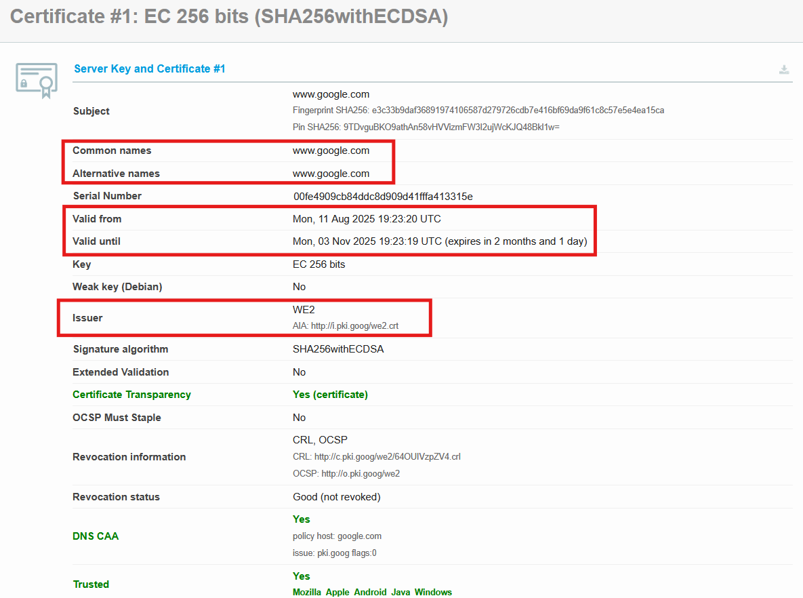
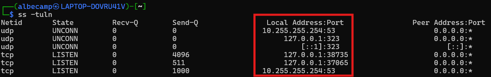

# Actividad 1: introducción devops, devsecops

**Nombre:** Luis Alanya Campos - 20210290J

**Fecha y tiempo invertido:** 

**Contexto del entorno:** 

## Desarrollo de la Actividad 1

### **1. DevOps vs cascada tradicional (investigación + comparación)**

**1.1.** DevOps vs Cascada

La imagen ayuda a diferenciar (de manera visual y fácil) las dos metodologías: DevOps y Cascada.

En el caso de la metodología de la cascada, vemos como la retroalimentación se hace en el proceso final del proyecto, retrasando las mejoras que se pudo haber hecho en previas etapas.

En el caso de la metodología DevOps, la retroalimentación se realiza en cualquier fase, y se hacen hacía cualquier fase. Así, cualquier crítica que se quiera hacer será siempre escuchada, haciendo más eficiente la comunicación y fortaleciendo el trabajo en equipo.

**1.2.** Explica por qué DevOps acelera y reduce riesgo en software para la nube frente a cascada (feedback continuo, pequeños lotes, automatización)

La metodología DevOps permite acelerar y reducir los riesgos en el tema de desarrollo de software para la nube, esto debido a que se recibe feedback/retroalimentación de forma seguida, detectando los errores tempranamente y corrigiéndolos. También, se trabaja en lotes pequeños de cambios, haciendo más fácil la detección y solución de problemas sin ponen en riesgo todo el sistema.

En el tema de la automatización, según Redondo y Cárdenas (2022), la automatización de pruebas y despliegue (CI/CD) disminuye de igual manera los errores humanos y también hace que todos los procesos sean más rápidos, a comparación del método en cascada, método tradicional donde los cambios se revisan y entregan solamente en la parte final. 

**1.3.** **Pregunta retadora:** señala un **contexto real** donde un enfoque cercano a cascada sigue siendo razonable (por ejemplo, sistemas con certificaciones regulatorias estrictas o fuerte acoplamiento hardware). Expón **dos criterios verificables** y **los trade-offs** (velocidad vs. conformidad/seguridad).

Un contexto real podría ser el desarrollo de software para el área de la medicina (equipos médicos), por ejemplo una máquina de escaneo de rayos X. Para estos casos se necesitan de certificaciones de entes reguladoras, además de una documentación detallada.

Criterios verificables:
- El cumplimiento de normativas y certificaciones, en este caso, la certificación ISO para dispositivos médicos.
- Realización de documentación completa, además de mantener una trazabilidad de los cambios que se hagan.

Trade-offs:
- Velocidad: El proceso en estos casos son más lentos debido a que cada fase debe completarse y luego pasar por un proceso de validación antes de pasar a la siguiente fase.
- Conformidad/seguridad: Para este caso, se prioriza la seguridad y el cumplimiento de normas envés de la rapidez, con el fin de reducir riesgos

---

### **2. Ciclo tradicional de dos pasos y silos(limitaciones y anti-patrones)**

**2.1.** Silos organizacionales

Los silos organizacionales son comunes en las organizaciones y pueden llegar a perjudicar la productividad y la colaboración. Estos ocurren cuando diferentes equipos acumulan información, generando una falta de comunicación entre equipos. En la imagen se muestra el proceso que se realiza cuando aparecen estos silos, la identificación de silos en la organización en el primer paso para superarlos y mejorar la colaboración.

**2.2.** Identifica **dos limitaciones** del ciclo "construcción -> operación" sin integración continua (por ejemplo, grandes lotes, colas de defectos).

- Primera limitación: Se generan grandes lotes de cambios, lo que hace difícil la busqueda y corrección de errores, debido a la gran acumulación de cambios que se generan antes de pasar a la fase de producción.
- Segunda limitación: Se forman grandes colas de defectos, ya que se los problemas/errores se detectan de manera tardía y se van acumulando, retrasando así las soluciones y aumentando el trabajo pendiente.

**2.3.** **Pregunta retadora:** define **dos anti-patrones** ("throw over the wall", seguridad como auditoría tardía) y explica cómo agravan incidentes (mayor MTTR, retrabajos, degradaciones repetitivas).

- Throw over the wall: Es cuando el equipo de desarrollo culmina su parte y simplemente entrega el software trabajado al equipo de operaciones, sin haber ninguna comunicación ni colaboración entre ambos equipos. Esto causa un desequilibrio en la información, ya que el equipo de operaciones no podría entender bien los cambios y podría llevar a cometer errores.
- Seguridad como auditoría tardía: En este caso,la seguridad revisa el software al final solamente, como si fuera una auditoría. Esto aumenta el costo de integración tardía debido a que los problemas de seguridad se detectan cuando ya es muy costoso y difícil arreglarlos.

---

### **3. Principios y beneficios de DevOps (CI/CD, automatización, colaboración; Agile como precursor)**

**3.1.** Describe CI y CD destacando **tamaño de cambios**, **pruebas automatizadas cercanas al código** y **colaboración**.

El CI (integración continua, por sus siglas en inglés) trata en realizar cambios pequeños de manera seguida en el código y que se prueban automáticamente luego de pocos minutos de haber sido escritos. El CI ayuda a detectar errores de manera rápida, además de que fomenta la colaboración debido a que todos los desarrolladores integran sus avances de manera seguida. Ahora, el CD (entrega continua, por sus siglas en inglés) permite la automatización del despliegue de los cambios que se realizan, esto permite que lleguen a producción de forma rápida y segura.

**3.2.** Explica cómo **una práctica Agile** (reuniones diarias, retrospectivas) alimenta decisiones del pipeline (qué se promueve, qué se bloquea).

Una práctica agile puede ser las reuniones diarias (también conocidas como dailies) en un equipo de desarrollo, donde se permite que el equipo comparta bloqueos y avances. Si en el daily se detecta un problema en una funcionalidad, en esa misma reunión se puede decidir no promover ese cambio en el pipeline hasta que se corrija. Así se demuestra que las decisiones sobre qué se despliega o bloquea se basan y funcionan gracias a la comunicación continua de un equipo.

**3.3.** Propón **un indicador observable** (no financiero) para medir mejora de colaboración Dev-Ops (por ejemplo, tiempo desde PR listo hasta despliegue en entorno de pruebas; proporción de rollbacks sin downtime).

Un indicador podría ser el tiempo que transcurre desde que un pull request (PR) está listo hasta que se despliega en el entorno de pruebas.

Para calcularlo sin necesidad de herramientas de pago, puede ser suficiente usar los metadatos de los PRs (momento de aprobación) y los registros de despliegue (fecha y hora en el que se aplicó el cambio). Al comparar ambos momentos, se consigue cuánto demora cada modificación en pasar de "lista" a "desplegado", lo cual permite evaluar la agilidad y también la coordinación entre eqquipos de desarrollo y operaciones.

---

### **4. Evolución a DevSecOps (seguridad desde el inicio: SAST/DAST; cambio cultural)**

**4.1.** Diferencia **SAST** (estático, temprano) y **DAST** (dinámico, en ejecución), y ubícalos en el pipeline.

El Static Application Security Testing (SAST) analiza el código fuente (binario también) antes de que la aplicación se ejecute, esto permite la detección de vulnerabilidades tempranamente, en la mayoría de casos en la fase de integración continua (CI). En otro caso, el Dynamic Application Security Testing (DAST) examina la aplicación que está en ejecución, buscando fallos en la seguridad mientras funciona, esto ocurre en la mayoría de casos después del despliegue en un entorno de pruebas en un pipelien.

**4.2.** Define un **gate mínimo de seguridad** con **dos umbrales cuantitativos** (por ejemplo, "cualquier hallazgo crítico en componentes expuestos **bloquea** la promoción"; "cobertura mínima de pruebas de seguridad del X%").

- Hallazgos críticos en componentes expuestos:
  - Si se detecta al menos una vulnerabilidad catalogada como alta o crítica en servicios accesibles desde internet, se procede a bloquear automáticamente hasta que se corrija.
- Cobertura mínima de pruebas de seguridad automatizadas (SAST y DAST):
  - Se pide como mínimo un 80% de cobertura en el análisis del código.
  - Si el umbral antes mencionado no se cumple, la promoción queda en espera de revisión y corrección.

**4.3.** Incluye una **política de excepción** con **caducidad**, responsable y plan de corrección.

En casos donde sea necesaria una excepción (por ejemplo, por restricciones de tiempo de despliegue o dependencia de terceros), se podría documentar una excepción de seguridad con algunas características necesarias:
- Definición de un límite de vigencia, por ejemplo un máximo de 15 días desde su aprobación.
- Asignación de un responsable, un lider que se comprometa a gestionar la corrección.
- Definición de un plan de corrección, se trataría de un documento conciso donde se especifica cómo, quién y en qué momento se tratará con el riesgo pendiente.

**4.4.** **Pregunta retadora:** ¿cómo evitar el "teatro de seguridad" (cumplir checklist sin reducir riesgo)? Propón **dos señales de eficacia** (disminución de hallazgos repetidos; reducción en tiempo de remediación) y cómo medirlas.

El teatro de seguridad pasa cuando los equipos cumplen los checklist de controles sin que ello signifique necesariamente una reducción real de riesgos. Dos señales de eficacia que podrían ayudar a evitarlo podrían ser:
- Disminución de hallazgos repetidos en reportes SAST/DAST
  - Se podría comparar los reportes de seguridad entre releases y verificar si la recurrencia de vulnerabilidades ya conocidas se reduce de una manera progresiva.
- Reducción en el tiempo promedio de solución
  - Se calcularía cuántos días pasan desde que se detecta una vulnerabilidad hasta el momento que se despliega la correción. Si se detecta una reducción, entonces eso indicaría que las prácticas de seguridad son efectivas.

  ---

### **5. CI/CD y estrategias de despliegue (sandbox, canary, azul/verde)**

**5.1.** Inserta una imagen del pipeline o canary en `imagenes/pipeline_canary.png`. 

El despliegue canary consiste en liberar una versión de una aplicación a un pequeño grupo de usuarios de forma gradual.

En la imagen se puede apreciar como hay un pequeño grupo de usuarios, declarados como 'Early adapters', que reciben una versión más avanzada de la aplicación, mientras que la gran mayoría de usuarios siguen usando la versión actual. Esto se realiza para probar la nueva versión sin afectar a la gran mayoría de usuarios.

**5.2.** Elige **una estrategia** para un microservicio crítico (por ejemplo, autenticación) y justifica.

Se podría elegir la estrategia canary para un microservicio crítico como lo es la autenticación. Esto nos permitiría lanzar una nueva versión solo para un pequeño grupo de usuarios inicialmente. Luego de verificar que todo funciona bien, se aumentaría el despliegue a más usuarios, poco a poco.

Esto ayuda al control del software, debido a que si hay un error, el impacto sería mínimo y se podría corregir de una manera rápida antes de que afecte a todos los usuarios.
  
**5.3.**  Crea una **tabla breve** de **riesgos vs. mitigaciones** (al menos tres filas), por ejemplo:

  * Regresión funcional -> validación de contrato antes de promover.
  * Costo operativo del doble despliegue -> límites de tiempo de convivencia.
  * Manejo de sesiones -> "draining" y compatibilidad de esquemas.
  
| Riesgo | Mitigación |
|-|-|
| Regresión funcional | Realización de validaciones completas y minuciosas de compatibilidad antes de mover los cambios a producción. |
| Costo operativo del doble despliegue | Definir límites claros de tiempo para la convivencia de versiones y para lograr una planificación de la transición gradual. |
| Manejo de sesiones | Implementación de técnicas de draining de sesiones activas y verificación en que los esquemas de datos mantengan compatibilidad hacia atrás. |

**5.4.** Define un **KPI primario** (p. ej., error 5xx, latencia p95) y un **umbral numérico** con **ventana de observación** para **promoción/abortado**.
  
Un KPI primario podría ser la tasa de errores de código 5xx. Pongamos un ejemplo, si durante una ventana de observación de ciertos minutos (30, por ejemplo) la tasa de errores (5xx) supera el 1%, entonces se abortaría la promoción y se revisaría el despliegue. (Amazon Web Services, s. f.)

**5.5.** **Pregunta retadora:** si el KPI técnico se mantiene, pero cae una métrica de producto (conversión), explica por qué **ambos tipos de métricas** deben coexistir en el gate.

Si un KPI técnico se mantiene bien pero cae una métrica de producto (como la conversión, por ejemplo), entonces sería un indicativo de que algo no está funcionando de manera correcta para el usuario, aunque el sistema no muestre ningun error técnicamente.

Es debido a esto que ambos tipos de métricas deberían estar en el gate, así se aseguraría estabilidad por las técnicas y las de producto asegurarían que el cambio realmente aporte valor sin afectar la experiencia del usuario. (Amazon Web Services, s. f.)

---

### **6. Fundamentos prácticos sin comandos (evidencia mínima)**

Realiza comprobaciones **con herramientas estándar**, pero **no** pegues los comandos. En el README escribe los **hallazgos** y la **interpretación**. Adjunta tus capturas en `imagenes/` y **marca** los campos relevantes (códigos, cabeceras, TTL, CN/SAN, fechas, puertos).

**6.1.** HTTP - contrato observable

   * Reporta: **método**, **código de estado** y **dos cabeceras** clave (por ejemplo, una de control de caché y otra de traza/diagnóstico).
   * Explica por qué esas cabeceras influyen en **rendimiento**, **caché** u **observabilidad**.
   * **Captura:** `imagenes/http-evidencia.png`, con los campos resaltados.

Resultados luego de pasar la página de [UNIVirtual](https://univirtual.uni.pe/) en la página [websniffer](https://websniffer.com)

La petición HTTP se realizó con el método *GET* y se obtuvo como respuesta un código *200 OK*, esto nos indica que el recurso se entregó correctamente.  

Entre las cabeceras obtenidas, está el *Cache-Control: no-store, no-cache*, esto evita almacenar el contenido en caché, asegurando así información siempre actualizada (afecta el rendimiento al necesitar de una descarga constante). También está la cabecera *X-Frame-Options: sameorigin*, que protege contra clickjacking (ataque donde un sitio malicioso engaña al usuario para que haga clic en algo oculto), además de que permite verificar medidas de seguridad al momento de la entrega de contenidos.

**6.2.** DNS - nombres y TTL

   * Reporta: **tipo de registro** (A o CNAME) y **TTL** de un dominio.
   * Explica cómo el **TTL** afecta **rollbacks** y cambios de IP (propagación, ventanas de inconsistencia).
   * **Captura:** `imagenes/dns-ttl.png`, con el TTL destacado.

Resultados luego de consultar el dominio [google.com](https://mxtoolbox.com/SuperTool.aspx) en la página [MXToolbox SuperTool](https://mxtoolbox.com/SuperTool.aspx)

El dominio tiene registros de tipo *A* con varias direcciones IP asociadas, además, todas presentan un TTL de *5 minutos*, lo que nos indica que los servidores y cachés DNS pueden mantener la información en memoria por ese determinado tiempo antes de solicitar una actualización.  

Un TTL corto, como en este caso, permite que los cambios de IP se propaguen rápidamente, además de que facilita el uso de rollbacks en caso de que se requiera revertir una configuración. Sin embargo, también implica más consultas a los servidores DNS. Ahora, si el TTL fuera largo, reduciría la carga de consultas pero también podría generar ventanas de inconsistencia, ya que los usuarios podrían seguir usando la IP antigua hasta que expire el TTL.

**6.3.** TLS - seguridad en tránsito

   * Reporta: **CN/SAN**, **vigencia (desde/hasta)** y **emisora** del certificado de un sitio seguro.
   * Explica qué sucede si **no valida** la cadena (errores de confianza, riesgo de MITM, impacto en UX).
   * **Captura:** `imagenes/tls-cert.png`, con CN/SAN, emisora y fechas.

Resultados luego de consultar el dominio [google.com](https://www.ssllabs.com/ssltest/analyze.html?d=google.com) en la página [SSL Labs](https://www.ssllabs.com/)  

El certificado presenta como *Common Name (CN)* y *Subject Alternative Name (SAN)* el dominio *www.google.com*. Tiene una vigencia desde el *11 de agosto de 2025* hasta el *3 de noviembre de 2025*, y fue emitido por la entidad *WE2 (Google Trust Services)*.  

Ahora, si el navegador o cliente no valida la cadena de confianza del certificado, se mostrarían errores de confianza además de alertas de conexión no privada. Esto expone al usuario a ataques de tipo "Man in the Middle" (MITM), que consiste en que un atacante podría interceptar el tráfico. Esto, evidentemente, afecta directamente en la experiencia de usuario, ya que la mayoría de navegadores bloquean el acceso o muestran advertencias que podrían generar desconfianza de los usuarios al sitio.  

**6.4.** Puertos - estado de runtime

   * Enumera **dos puertos en escucha** en tu máquina o entorno y **qué servicios** sugieren.
   * Explica cómo esta evidencia ayuda a detectar **despliegues incompletos** (puerto no expuesto) o **conflictos** (puerto ocupado).
   * **Captura:** `imagenes/puertos.png`, con los puertos resaltados.

Resultados luego de ejecutar el comando `ss -tuln` en mi máquina local.  

En este caso se identificaron pocos puertos en escucha, entre ellos el *53 (TCP/UDP)* asociado en la mayoría de casos a un servicio de "DNS local", y el *323 (UDP)* que suele significar "chronyd" o "ntpd", para la sincronización de tiempo.

Ahora, esta muestra es útil porque nos permite verificar si los servicios realmente están activos. En caso de que un puerto esperado no aparezca en escucha, podría significar un despliegue incompleto, o sea, que el servicio no levantó correctamente. En otro caso, si un puerto está ocupado por otro proceso, podría generar un conflicto que podría impedir que la aplicación arranque en el puerto definido.

**6.5.** 12-Factor - port binding, configuración, logs

   * Describe **cómo** parametrizarías el puerto sin tocar código (config externa).
   * Indica **dónde** verías los logs en ejecución (flujo estándar) y **por qué** no deberías escribirlos en archivos locales rotados a mano.
   * Señala un **anti-patrón** (p. ej., credenciales en el código) y su impacto en reproducibilidad.

Para este caso, el puerto de la aplicación no debería estar “fijo” en el código, sino parametrizado por medio de una variable de entorno o archivo de configuración externa (por ejemplo, "PORT=8080" en un `.env`). Esto nos permite mover la aplicación a diferentes entornos sin la necesidad de modificar el código fuente, mejorando la portabilidad.

Hablando de los logs, lo correcto sería que la aplicación escriba siempre en la salida estándar (stdout y stderr). Esto facilita que cualquier orquestador (Kubernetes, por ejemplos) pueda recolectar los registros de forma automática. Ahora, escribir en archivos locales y rotarlos manualmente sería una mala práctica, ya que dificultaría el monitoreo y generaría riesgo de pérdida de información.

Finalmente, un anti-patrón típico es dejar credenciales dentro del código (por ejemplo, una contraseña hardcodeada). Esto, evidentemente, sería un impacto negativo en la seguridad y rompería la reproducibilidad, pues implica exponer información sensible en el código.

**6.6.** Checklist de diagnóstico (incidente simulado)

   * **Escenario:** usuarios reportan intermitencia. Formula un checklist de **seis pasos ordenados** que permita discriminar:
     a) contrato HTTP roto, b) resolución DNS inconsistente, c) certificado TLS caducado/incorrecto, d) puerto mal configurado/no expuesto.
   * Para cada paso, indica: **objetivo**, **evidencia esperada**, **interpretación** y **acción siguiente**.
   * Evita generalidades; sé **operacional** (si X ocurre, entonces Y decisión).

Según lo pedido, en un escenario donde los usuarios reportan intermitencia, se puede aplicar un checklist de pasos concretos que permitan ir descartando posibles causas:  

1. **Contrato HTTP**  
   - **Objetivo:** validar si la aplicación responde con un código de estado esperado (ej. 200).
   - **Evidencia esperada:** si devuelve 500 o 503, hay un problema en backend.
   - **Interpretación y acción:** el contrato está roto, entonces se revisaría los logs de aplicación.

2. **Resolución DNS**  
   - **Objetivo:** comprobar si los clientes están resolviendo la IP correcta.  
   - **Evidencia esperada:** distintos resolvers pueden entregar IPs diferentes si el TTL es muy bajo o está en plena propagación.  
   - **Interpretación y acción:** la inconsistencia en resolución puede causar intermitencia → esperar propagación o ajustar TTL.  

3. **Certificado TLS**  
   - **Objetivo:** validar vigencia y confianza de la cadena.
   - **Evidencia esperada:** un CN/SAN incorrecto o certificado expirado provocaría rechazos del cliente.
   - **Interpretación y acción:** errores de confianza podrían simular caídas, entonces se renovaría el certificado o revisar la configuración.

4. **Puertos en escucha**  
   - **Objetivo:** confirmar que el servicio realmente está siendo levantado en el puerto configurado.
   - **Evidencia esperada:** si el puerto no aparece abierto quiere decir que el servicio no se desplegó correctamente.  
   - **Interpretación y acción:** podría ser un despliegue incompleto o conflicto con otro proceso, entonces se reiniciaría el servicio o simplemente liberar el puerto.  
